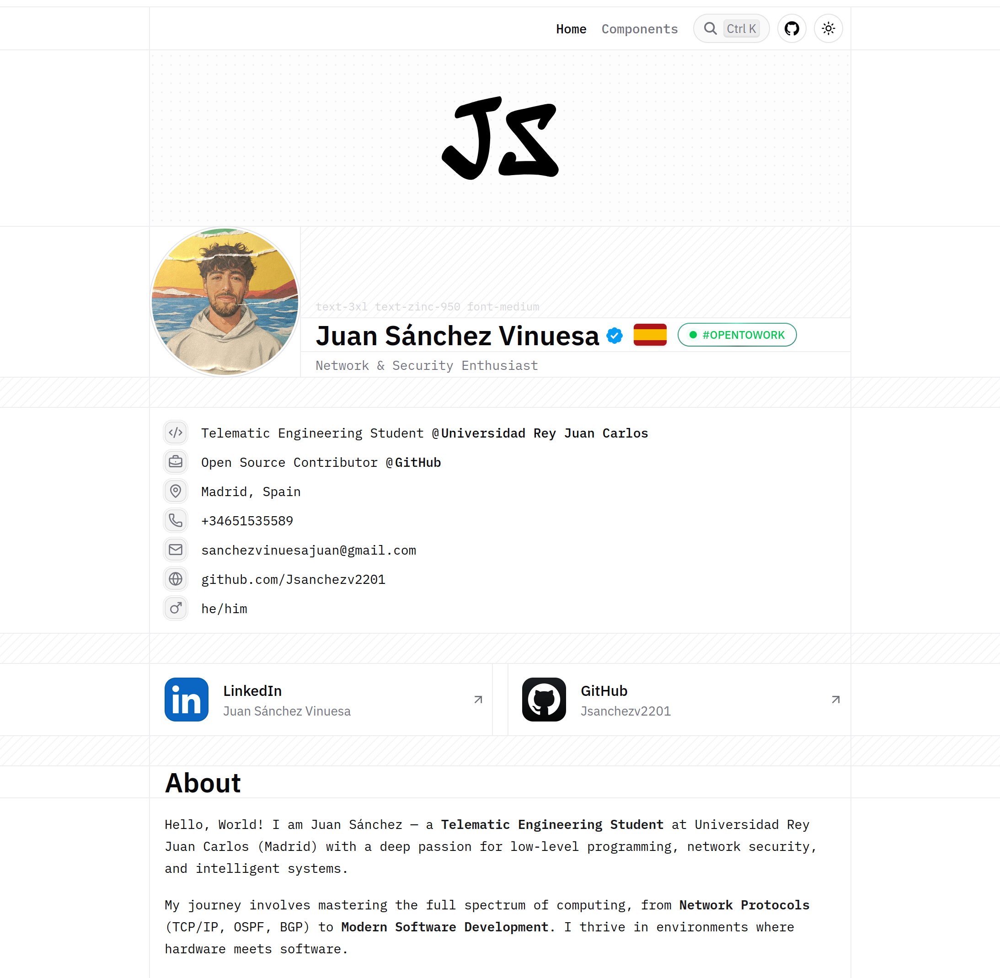

# Portfolio - Juan Sánchez

[](https://nextjs.org/)
[](https://www.typescriptlang.org/)
[](https://tailwindcss.com/)
[](./LICENSE)

> **Ingeniero Telemático | Systems Programming (Rust/C++) | AI & Computer Vision**

Este repositorio contiene el código fuente de mi portfolio personal, diseñado para ser minimalista, rápido y accesible. Aquí muestro mi trayectoria en ingeniería de redes, desarrollo de bajo nivel y robótica.

🌐 [jsanchezv2201.com](https://portfolio-jsanchezv2201.vercel.app/) 

---

## 📸 Vista Previa

<div align="center">
  
  </div>

---

## ⚡ Características del Portafolio

Esta web ha sido construida prestando atención al detalle técnico y al rendimiento:

* **Arquitectura Moderna:** Basado en Next.js 15 (App Router) y React Server Components.
* **Diseño Responsivo:** UI construida con Tailwind CSS v4 y componentes accesibles de Shadcn/ui.
* **SEO Optimizado:** Integración completa de Metadata, Sitemap y JSON-LD Schema.
* **Modo Oscuro/Claro:** Detección automática de preferencias del sistema.
* **Blog Integrado:** Soporte para MDX con resaltado de sintaxis para compartir conocimiento técnico.

---

## 💻 Instalación y Desarrollo Local

Si quieres explorar el código de este portfolio:

1.  **Clonar el repositorio:**
    ```bash
    git clone [https://github.com/Jsanchezv2201/portfolio.git](https://github.com/Jsanchezv2201/portfolio.git)
    cd portfolio
    ```

2.  **Instalar dependencias:**
    ```bash
    pnpm install
    # o si usas npm:
    # npm install
    ```

3.  **Ejecutar servidor de desarrollo:**
    ```bash
    pnpm dev
    ```
    Abre [http://localhost:3000](http://localhost:3000) en tu navegador.

---

## 📄 Licencia

Este proyecto está bajo la licencia [MIT](./LICENSE).

---
